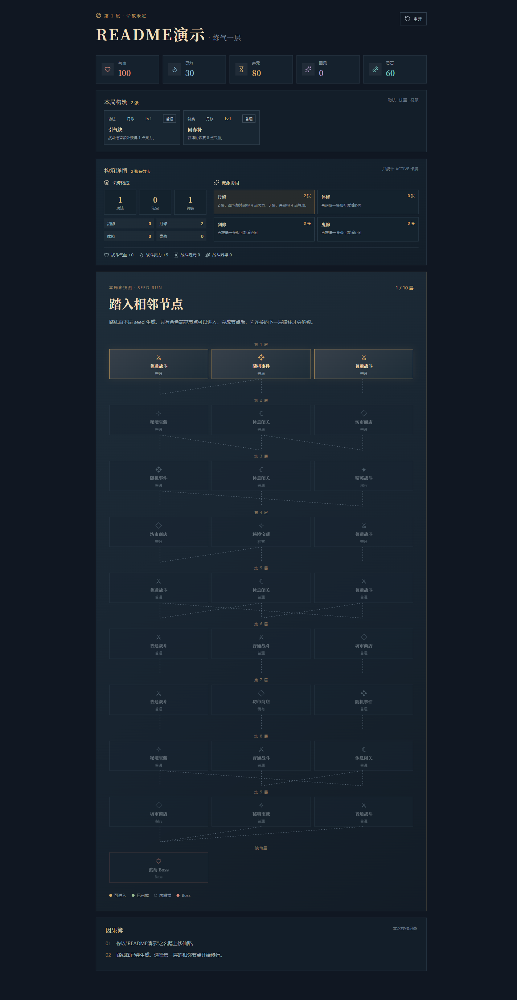

# 逆命仙途

一个由 Java 后端驱动的文字修仙肉鸽游戏原型。

开发路线请查看：[DEVELOPMENT_PLAN.md](./DEVELOPMENT_PLAN.md)

## 技术栈

- 后端：Java 21+、Spring Boot、Spring Data JPA
- 数据库：MySQL 8
- 前端：React、TypeScript、Vite
- 部署辅助：Docker Compose

## 当前 MVP

- 创建角色并选择出身
- 开启一局修仙旅程
- 随机事件与三选一决策
- 每局 seed 生成 10 层路线图，每层多个节点并通过连线限制相邻选择
- 普通战斗、精英战斗、随机事件、休息闭关、坊市商店、秘境宝藏、渡劫 Boss
- 节点内容按权重抽取，支持稀有事件、可重复事件和多种特殊结局
- 初始功法/符箓构筑，战斗、精英和秘境节点提供奖励三选一
- 卡牌效果会影响后续战斗结算，奖励选择支持存档恢复
- V0.5 回合战斗：敌人攻击、防御、中毒、蓄力意图可见，玩家可普通攻击、守势、调息、构筑战技或净脉
- 战斗状态保存到 `run_combat`，刷新或恢复存档不会丢失敌方气血、护盾、中毒和当前意图
- 灵石资源与休息/闭关节点卡牌升级，升级状态支持存档恢复
- 卡牌移除：坊市消耗 30 灵石一次，天关黑市特殊事件免费一次，保留 REMOVED 历史
- 坊市 3 张商品、普通/稀有/传说 20/35/55 灵石定价，刷新费用 10/15 灵石且最多 2 次
- 剑修、丹修、体修、鬼修 2 卡基础/3 卡强化流派协同
- 条件化奖励池：精英、楼层、节点稀有度、事件稀有度和当前流派都会影响权重
- 构筑统计面板：卡牌类别、流派数量、协同说明和战斗主要加成
- 25 张卡牌通过 `card-config.json` 幂等初始化到 `skill_config`、`item_config`、`talisman_config`，新增 8 张战斗专属卡牌
- 生命、灵力、寿元、因果属性变化
- 存档到 MySQL
- React 前端展示路线图、节点连线、当前事件和修仙日志

## V0.4 界面预览

构筑统计、流派协同与每局随机路线图：



## 启动数据库

```powershell
docker compose up -d mysql
```

如果本机已经有 MySQL 8，可以使用 `database/init.sql` 创建项目数据库和项目账号：

```powershell
mysql -u root -p < database/init.sql
```

该脚本只操作 `xiuxian_game` 数据库和 `xiuxian` 项目账号，不会删除其他数据库或用户数据。

## 启动后端

```powershell
cd backend
mvn spring-boot:run
```

后端默认地址：`http://localhost:8080`

## 启动前端

```powershell
cd frontend
npm install
npm run dev
```

前端默认地址：`http://localhost:5173`

## 主要接口

| 方法 | 路径 | 作用 |
| --- | --- | --- |
| POST | `/api/game/runs` | 创建一局游戏并生成路线图 |
| GET | `/api/game/runs/{id}` | 查询游戏存档 |
| POST | `/api/game/runs/{id}/nodes/{nodeId}/enter` | 进入当前可达节点 |
| POST | `/api/game/runs/{id}/choices` | 提交事件选择并解锁下一跳 |
| POST | `/api/game/runs/{id}/rewards/{rewardId}/claim` | 领取一张构筑奖励并解锁路线 |
| POST | `/api/game/runs/{id}/upgrades/{cardId}` | 在闭关节点消耗灵石升级卡牌 |
| POST | `/api/game/runs/{id}/upgrades/skip` | 跳过本次闭关升级并解锁路线 |
| POST | `/api/game/runs/{id}/removals/{cardId}` | 特殊事件免费移除一张有效卡牌 |
| POST | `/api/game/runs/{id}/removals/skip` | 跳过特殊事件移除 |
| POST | `/api/game/runs/{id}/shops/{offerId}/buy` | 购买坊市商品并加入构筑 |
| POST | `/api/game/runs/{id}/shops/refresh` | 消耗递增灵石刷新坊市 |
| POST | `/api/game/runs/{id}/shops/remove/{cardId}` | 消耗 30 灵石移除坊市卡牌 |
| POST | `/api/game/runs/{id}/shops/leave` | 关闭坊市并解锁下一层 |

完整请求/响应字段说明见：[API.md](./API.md)；V0.4 逐项验收见：[V0.4_ACCEPTANCE.md](./V0.4_ACCEPTANCE.md)。

## 默认数据库配置

数据库地址：`localhost:3306/xiuxian_game`

用户名：`xiuxian`

密码：`xiuxian_dev`
