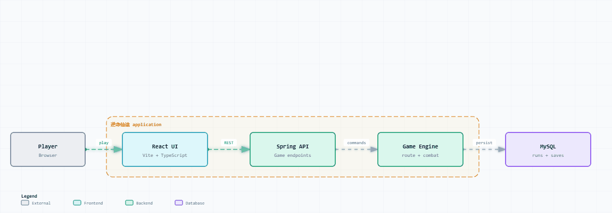

# 逆命仙途 — Java 后端驱动的文字修仙肉鸽游戏

> **服务端权威计算 · 10 层随机路线图 · 意图可见回合战斗 · 25+ 卡牌流派构筑 · 动态配置中心 · 因果轮回与永久成长**

《逆命仙途》是一个由 Java 21+ 与 Spring Boot 后端驱动的文字修仙肉鸽（Roguelike）游戏系统。项目采用前后端分离架构，游戏核心逻辑（节点生成、事件判定、卡牌升级/移除、回合战斗、因果结算与成就系统）全部由服务端权威计算，结合 React + TypeScript 前端提供沉浸式的修仙决策与构筑体验。

---

## ✨ 核心特性

- 🎯 **角色出身与路线生成**：支持创建角色并选择不同出身；每局基于独立 Seed 动态生成 10 层修仙路线图，相邻节点受连线拓扑限制。
- ⚔️ **丰富节点与意图可见战斗**：涵盖普通战斗、精英战斗、随机事件、休息闭关、坊市商店、秘境宝藏与渡劫 Boss；回合制战斗中敌方攻击、防御、中毒、蓄力意图完全可见。
- 🎴 **深度卡牌构筑与流派协同**：内置 25+ 张功法/法宝/符箓卡牌，支持剑修、丹修、体修、鬼修四大流派（2 卡基础 / 3 卡强化协同）；提供坊市购买、灵石升级与特殊事件卡牌移除。
- ⚙️ **动态事件与卡牌配置中心**：28 个事件、6 个结局、78 个选项及卡牌配置均支持从 JSON 幂等导入、版本管理、引用校验与缓存热重载，无需修改核心代码即可调整内容。
- 🔄 **因果点数与永久轮回成长**：死亡/飞升终局自动生成不可变结算快照与积分排行榜（天道榜）；结算发放永久因果点数，可解锁 9 项永久属性加成，跨局继承。
- 🏆 **多维成就系统与安全鉴权**：包含开局、结算与构筑多维成就，达成自动发放因果奖励；采用 PBKDF2 + JWT 实现玩家账号隔离，后台管理接口支持独立 Admin Token 鉴权。

---

## 🚀 快速开始

### 1. 启动数据库

使用 Docker Compose 一键启动 MySQL 8：

```powershell
docker compose up -d mysql
```

若本机已安装 MySQL 8，可直接执行初始化脚本创建项目专用数据库与账号：

```powershell
mysql -u root -p < database/init.sql
```

> **注意**：初始化脚本仅操作 `xiuxian_game` 数据库和 `xiuxian` 项目账号，不会影响其他数据库或用户数据。

### 2. 启动后端服务

```powershell
cd backend
mvn spring-boot:run
```

- 后端默认地址：`http://localhost:8080`

### 3. 启动前端客户端

```powershell
cd frontend
npm install
npm run dev
```

- 前端默认地址：`http://localhost:5173`

---

## 🖼️ 界面预览

### V0.4 构筑统计、流派协同与随机路线图


---

### V0.6 运行效果（启动页、路线图与回合战斗面板）


---

## 📂 项目结构

```text
xiuxian-roguelike/
├── backend/                    # Spring Boot 后端工程
│   ├── src/                    # 业务源码 (Controller, Service, Domain, Config)
│   └── pom.xml                 # Maven 依赖配置 (Java 21, Spring Boot, JPA, MySQL)
├── frontend/                   # React + TypeScript + Vite 前端工程
│   ├── src/                    # 页面组件、状态机、Canvas 路线图与 API 封装
│   ├── package.json            # 前端依赖配置
│   └── vite.config.ts          # Vite 构建配置
├── database/                   # 数据库脚本与迁移
│   ├── init.sql                # 基础数据库建表与初始用户脚本
│   └── migrations/             # 历史版本增量迁移 SQL
├── docs/                       # 项目设计与架构文档
│   ├── architecture/           # 动态系统架构图生成资产
│   └── 开源参考与作品路线图.md    # 高星项目对标与演进路线
├── output/playwright/          # E2E 自动化测试与界面截图证据
├── docker-compose.yml          # 本地 MySQL 8 容器编排
├── API.md                      # 完整接口参数与请求响应规范
├── DEVELOPMENT_PLAN.md         # 阶段开发路线图与任务拆解
└── V0.4_ACCEPTANCE.md          # 核心版本逐项验收记录
```

---

## 🛠️ 技术栈 / 技术原理

### 核心技术栈

- **后端架构**：Java 21+、Spring Boot、Spring Data JPA、Eloquent-style 状态持久化
- **数据库**：MySQL 8.0（支持 Docker Compose 容器化编排）
- **前端技术**：React、TypeScript、Vite、Tailwind CSS、Canvas 路线连线拓扑
- **安全与鉴权**：PBKDF2 密码哈希、JWT 令牌鉴权、Admin-Token 独立配置中心权限
- **测试与验证**：JUnit 5、Playwright E2E 端到端测试

### 主要 API 接口一览

| 方法 | 路径 | 作用 |
| :--- | :--- | :--- |
| POST | `/api/game/runs` | 创建一局游戏并生成路线图 |
| POST | `/api/auth/register` | 注册账号并返回 JWT 与初始角色 |
| POST | `/api/auth/login` | 登录账号并返回 JWT |
| POST | `/api/auth/logout` | 无状态登出，由前端清除 JWT |
| GET | `/api/players/me` | 查询当前账号及角色列表 |
| POST | `/api/players` | 创建当前账号下的新角色 |
| GET | `/api/game/runs` | 查询当前账号最近存档 |
| GET | `/api/account/progress` | 查询因果点、永久解锁、成就、账号统计和最近结算历史 |
| POST | `/api/account/unlocks/{unlockId}` | 消耗因果点购买永久解锁 |
| GET | `/api/game/runs/{id}` | 查询游戏存档 |
| POST | `/api/game/runs/{id}/nodes/{nodeId}/enter` | 进入当前可达节点 |
| POST | `/api/game/runs/{id}/choices` | 提交事件选择并解锁下一跳 |
| POST | `/api/game/runs/{id}/rewards/{rewardId}/claim` | 领取一张构筑奖励并解锁路线 |
| POST | `/api/game/runs/{id}/upgrades/{cardId}` | 在闭关节点消耗灵石升级卡牌 |
| POST | `/api/game/runs/{id}/upgrades/skip` | 跳过本次闭关升级并解锁路线 |
| POST | `/api/game/runs/{id}/removals/{cardId}` | 特殊事件免费移除一张有效卡牌 |
| POST | `/api/game/runs/{id}/removals/skip` | 跳过特殊事件移除 |
| POST | `/api/game/runs/{id}/shops/{offerId}/buy` | 购买坊市商品并加入构筑 |
| POST | `/api/game/runs/{id}/shops/refresh` | 消耗递增灵石刷新坊市 |
| POST | `/api/game/runs/{id}/shops/remove/{cardId}` | 消耗 30 灵石移除坊市卡牌 |
| POST | `/api/game/runs/{id}/shops/leave` | 关闭坊市并解锁下一层 |
| GET | `/api/admin/config/events` | 查询事件/结局配置和校验状态 |
| POST | `/api/admin/config/events/import` | 导入版本化事件 JSON 配置 |
| GET | `/api/admin/config/cards` | 查询功法、法宝、符箓统一配置 |
| POST | `/api/admin/config/cards/import` | 统一导入卡牌配置并执行校验 |
| POST | `/api/admin/config/validate` | 校验当前启用配置并写入操作日志 |
| POST | `/api/admin/config/reload` | 重载事件配置缓存并校验 |
| GET | `/api/admin/config/logs` | 查看最近 50 条配置操作日志 |
| GET | `/api/leaderboard?limit=10` | 查询已完成旅程的积分排行榜 |

> 完整请求/响应字段说明见：[API.md](./API.md)；V0.4 逐项验收见：[V0.4_ACCEPTANCE.md](./V0.4_ACCEPTANCE.md)。

---

## ⚠️ 数据库配置与环境边界

- **默认数据库地址**：`localhost:3306/xiuxian_game`
- **默认用户名 / 密码**：`xiuxian` / `xiuxian_dev`
- **JWT 配置**：游戏接口要求 `Authorization: Bearer <JWT>`，生产部署需配置 `JWT_SECRET`（至少 32 字符）与 `JWT_EXPIRATION_MS`。
- **配置中心管理员鉴权**：后台配置接口需携带 `ADMIN_CONFIG_TOKEN`（本地开发默认 `dev-admin-token`），与玩家 JWT 隔离。
- **数据持久化与一致性**：战斗状态保存至 `run_combat`，因果与永久解锁记录分别写入 `user_account` 与 `unlock_record`，刷新或恢复存档不会丢失进度。

---

## 🏗️ 动态系统架构图



- 🌐 [打开交互式动态架构图](docs/architecture/dynamic-archify-architecture.html)
- 📊 [查看架构源数据 (JSON)](docs/architecture/dynamic-archify-architecture.json)

---

## 📚 开发路线与文档索引

- 🗺️ [开发路线规划图 (DEVELOPMENT_PLAN.md)](./DEVELOPMENT_PLAN.md)
- 📖 [开源参考与作品路线图 (docs/开源参考与作品路线图.md)](./docs/开源参考与作品路线图.md)
- 📝 [接口规范说明书 (API.md)](./API.md)
- ✅ [版本逐项验收报告 (V0.4_ACCEPTANCE.md)](./V0.4_ACCEPTANCE.md)
