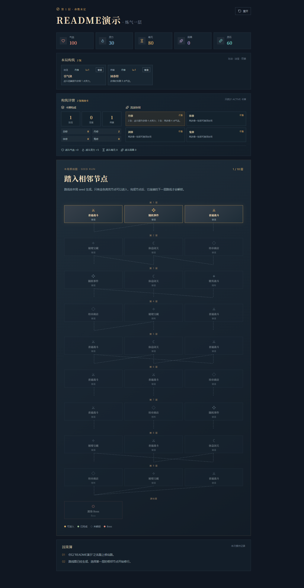
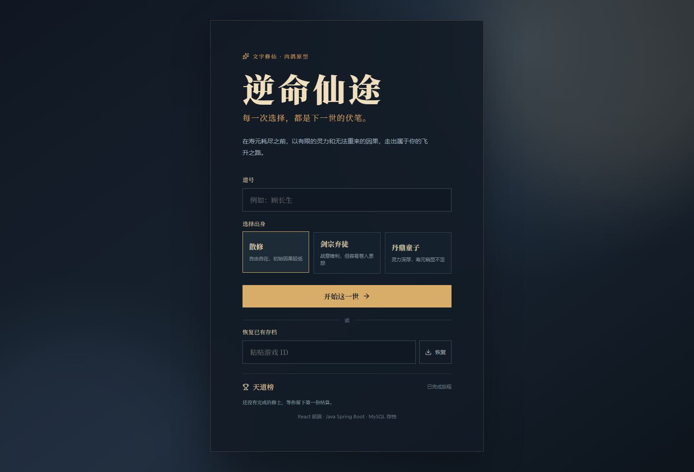
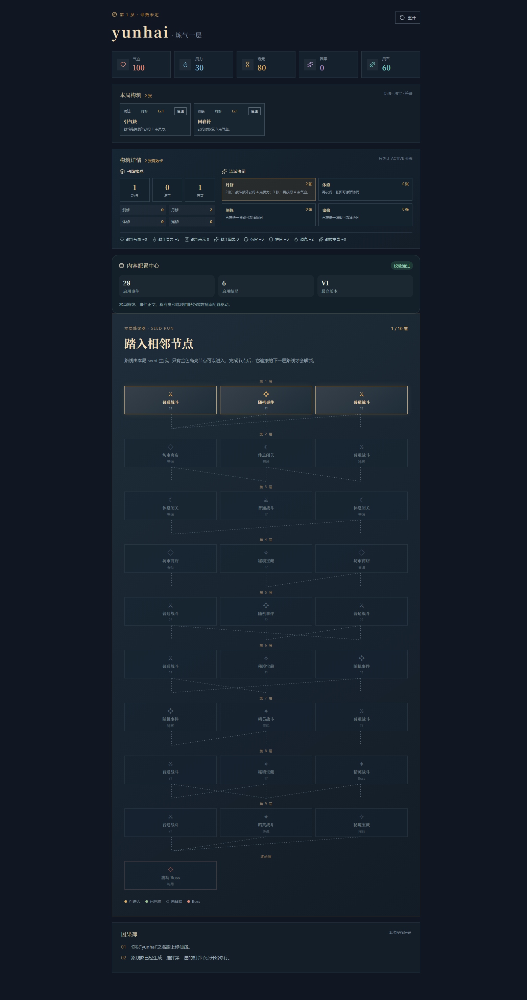
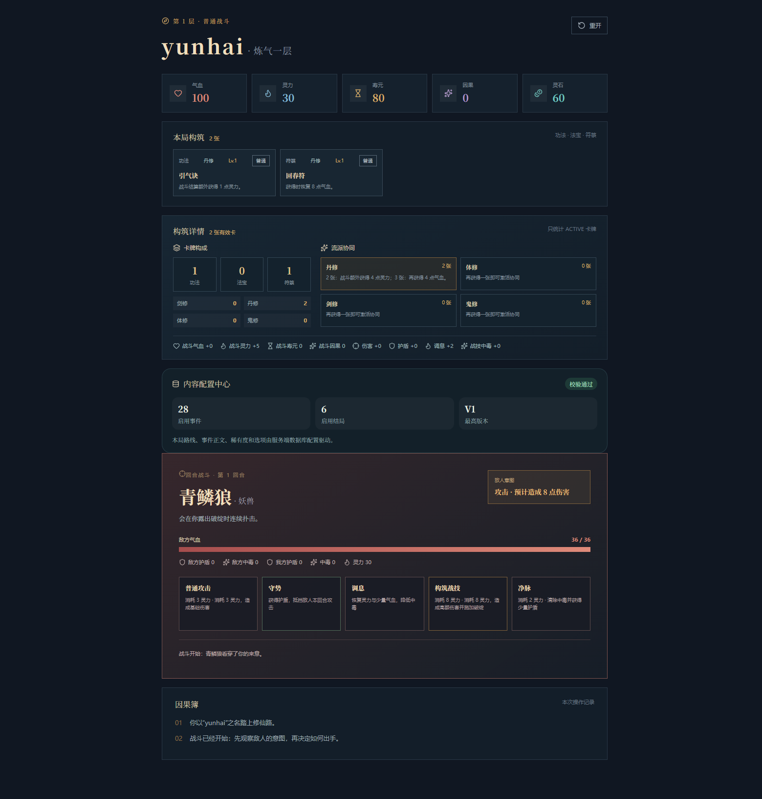

# 逆命仙途

一个由 Java 后端驱动的文字修仙肉鸽游戏原型。

开发路线请查看：[DEVELOPMENT_PLAN.md](./DEVELOPMENT_PLAN.md)

## 技术栈

- 后端：Java 21+、Spring Boot、Spring Data JPA
- 数据库：MySQL 8
- 前端：React、TypeScript、Vite
- 部署辅助：Docker Compose

## 当前 MVP

- 创建角色并选择出身
- 开启一局修仙旅程
- 随机事件与三选一决策
- 每局 seed 生成 10 层路线图，每层多个节点并通过连线限制相邻选择
- 普通战斗、精英战斗、随机事件、休息闭关、坊市商店、秘境宝藏、渡劫 Boss
- 节点内容按权重抽取，支持稀有事件、可重复事件和多种特殊结局
- 初始功法/符箓构筑，战斗、精英和秘境节点提供奖励三选一
- 卡牌效果会影响后续战斗结算，奖励选择支持存档恢复
- V0.5 回合战斗：敌人攻击、防御、中毒、蓄力意图可见，玩家可普通攻击、守势、调息、构筑战技或净脉
- 战斗状态保存到 `run_combat`，刷新或恢复存档不会丢失敌方气血、护盾、中毒和当前意图
- 灵石资源与休息/闭关节点卡牌升级，升级状态支持存档恢复
- 卡牌移除：坊市消耗 30 灵石一次，天关黑市特殊事件免费一次，保留 REMOVED 历史
- 坊市 3 张商品、普通/稀有/传说 20/35/55 灵石定价，刷新费用 10/15 灵石且最多 2 次
- 剑修、丹修、体修、鬼修 2 卡基础/3 卡强化流派协同
- 条件化奖励池：精英、楼层、节点稀有度、事件稀有度和当前流派都会影响权重
- 构筑统计面板：卡牌类别、流派数量、协同说明和战斗主要加成
- 25 张卡牌通过 `card-config.json` 幂等初始化到 `skill_config`、`item_config`、`talisman_config`，新增 8 张战斗专属卡牌
- V0.6 事件配置中心：28 个事件、6 个结局和 78 个选项从 `event-config.json` 幂等初始化到 `event_config`
- 事件配置支持版本号、启用状态、JSON 导入、引用校验、缓存重载和操作日志，不改 Java 核心即可调整内容
- V0.6 卡牌统一导入接口：功法、法宝、符箓使用同一套 JSON 字段导入，并自动重建缓存、校验和记录操作日志
- 配置中心管理员鉴权：`/api/admin/**` 支持 `X-Admin-Token` 或 `Authorization: Bearer`，生产环境使用 `ADMIN_CONFIG_TOKEN`
- V0.6 终局自动生成不可变结算快照，按进度、属性、精英和构筑计算积分，并提供天道榜
- V0.3 账号体系：注册/登录使用 PBKDF2 密码哈希和 JWT，角色与游戏存档按账号隔离
- V0.3 前端支持登录态恢复、角色切换/创建、当前账号最近存档列表和授权恢复
- V0.7 账号级因果点：死亡/飞升结算发放永久资源，支持五项永久解锁和最近轮回历史
- V0.7 永久解锁会影响后续新局初始气血、灵力、寿元、因果和灵石，所有计算由服务端完成
- V0.8 账号成就：开局、结算和构筑目标自动判定，成就状态按账号隔离并保留达成时间
- V0.8 永久成长扩展到九项解锁，账号面板展示总轮回、飞升/陨落、最高层数、最高分和成就进度
- 生命、灵力、寿元、因果属性变化
- 存档到 MySQL
- React 前端展示路线图、节点连线、当前事件和修仙日志

## V0.4 界面预览

构筑统计、流派协同与每局随机路线图：



## V0.6 运行截图

启动页、随机路线图和回合战斗面板：







## 启动数据库

```powershell
docker compose up -d mysql
```

如果本机已经有 MySQL 8，可以使用 `database/init.sql` 创建项目数据库和项目账号：

```powershell
mysql -u root -p < database/init.sql
```

该脚本只操作 `xiuxian_game` 数据库和 `xiuxian` 项目账号，不会删除其他数据库或用户数据。

## 启动后端

```powershell
cd backend
mvn spring-boot:run
```

后端默认地址：`http://localhost:8080`

## 启动前端

```powershell
cd frontend
npm install
npm run dev
```

前端默认地址：`http://localhost:5173`

## 主要接口

| 方法 | 路径 | 作用 |
| --- | --- | --- |
| POST | `/api/game/runs` | 创建一局游戏并生成路线图 |
| POST | `/api/auth/register` | 注册账号并返回 JWT 与初始角色 |
| POST | `/api/auth/login` | 登录账号并返回 JWT |
| POST | `/api/auth/logout` | 无状态登出，由前端清除 JWT |
| GET | `/api/players/me` | 查询当前账号及角色列表 |
| POST | `/api/players` | 创建当前账号下的新角色 |
| GET | `/api/game/runs` | 查询当前账号最近存档 |
| GET | `/api/account/progress` | 查询因果点、永久解锁、成就、账号统计和最近结算历史 |
| POST | `/api/account/unlocks/{unlockId}` | 消耗因果点购买永久解锁 |
| GET | `/api/game/runs/{id}` | 查询游戏存档 |
| POST | `/api/game/runs/{id}/nodes/{nodeId}/enter` | 进入当前可达节点 |
| POST | `/api/game/runs/{id}/choices` | 提交事件选择并解锁下一跳 |
| POST | `/api/game/runs/{id}/rewards/{rewardId}/claim` | 领取一张构筑奖励并解锁路线 |
| POST | `/api/game/runs/{id}/upgrades/{cardId}` | 在闭关节点消耗灵石升级卡牌 |
| POST | `/api/game/runs/{id}/upgrades/skip` | 跳过本次闭关升级并解锁路线 |
| POST | `/api/game/runs/{id}/removals/{cardId}` | 特殊事件免费移除一张有效卡牌 |
| POST | `/api/game/runs/{id}/removals/skip` | 跳过特殊事件移除 |
| POST | `/api/game/runs/{id}/shops/{offerId}/buy` | 购买坊市商品并加入构筑 |
| POST | `/api/game/runs/{id}/shops/refresh` | 消耗递增灵石刷新坊市 |
| POST | `/api/game/runs/{id}/shops/remove/{cardId}` | 消耗 30 灵石移除坊市卡牌 |
| POST | `/api/game/runs/{id}/shops/leave` | 关闭坊市并解锁下一层 |
| GET | `/api/admin/config/events` | 查询事件/结局配置和校验状态 |
| POST | `/api/admin/config/events/import` | 导入版本化事件 JSON 配置 |
| GET | `/api/admin/config/cards` | 查询功法、法宝、符箓统一配置 |
| POST | `/api/admin/config/cards/import` | 统一导入卡牌配置并执行校验 |
| POST | `/api/admin/config/validate` | 校验当前启用配置并写入操作日志 |
| POST | `/api/admin/config/reload` | 重载事件配置缓存并校验 |
| GET | `/api/admin/config/logs` | 查看最近 50 条配置操作日志 |
| GET | `/api/leaderboard?limit=10` | 查询已完成旅程的积分排行榜 |

完整请求/响应字段说明见：[API.md](./API.md)；V0.4 逐项验收见：[V0.4_ACCEPTANCE.md](./V0.4_ACCEPTANCE.md)。

游戏接口默认要求 `Authorization: Bearer <JWT>`。JWT 配置项为 `JWT_SECRET`（至少 32 个字符）和 `JWT_EXPIRATION_MS`；本地开发可使用默认值，部署时应覆盖。

配置中心接口需要独立的管理员令牌。本地开发默认使用 `dev-admin-token`；部署时请设置 `ADMIN_CONFIG_TOKEN`，不要使用默认值。管理员令牌不等同于玩家 JWT。

V0.7 永久进度接口需要玩家 JWT。结算时服务端将因果点写入 `user_account`，并在 `run_settlement.causality_earned` 保存本局发放快照；重复恢复不会重复发放。永久解锁记录写入 `unlock_record`，同一账号不能重复购买同一解锁。

V0.8 成就记录写入 `achievement_record`，由服务端在创建第一局和终局结算时自动判定；账号进度中的 `achievements` 返回完整目录、解锁状态、条件和达成时间。统计字段包括总存档、完成轮回、飞升/陨落次数、最高抵达层数、最高积分和已解锁成就数。

## 默认数据库配置

数据库地址：`localhost:3306/xiuxian_game`

用户名：`xiuxian`

密码：`xiuxian_dev`
